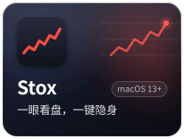
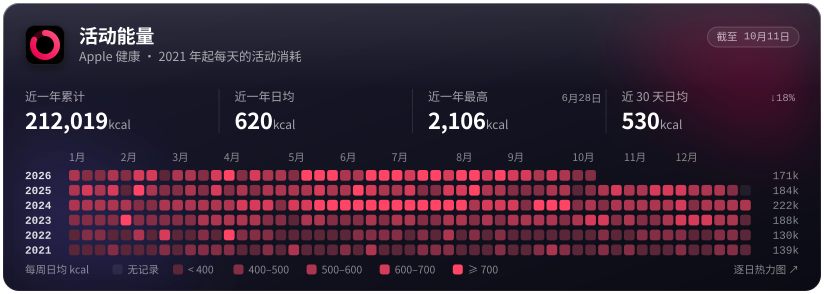

<a href="https://whrss.com">博客</a> · <a href="https://whrss.com/feed">RSS</a> · <a href="mailto:whrss9527@gmail.com">邮箱</a>

<!-- four tiles at 25% fill the row exactly; the comments swallow the line breaks, which would otherwise add gaps -->

  <!--
--><!--
--><!--
-->

#### 最新文章

<!-- BLOG-POSTS:START -->
- [给博客做了一轮大改：多端、离线、服务端渲染和一堆小东西](https://whrss.com/posts/goblog-refactor)
- [一致性事务：从 2PC 到 Outbox pattern](https://whrss.com/posts/transaction-consistency-patterns-2pc-outbox)
- [鸿蒙 OS 的签名密钥机制，我终于整明白了！](https://whrss.com/posts/harmonyos-signing-key)
- [数据库分表实践：如何优雅地切换到分表架构](https://whrss.com/posts/mysql-sharding-migration)
- [“该省省，该花花”](https://whrss.com/posts/smart-spending)
<!-- BLOG-POSTS:END -->

数据由 GitHub Action 自动同步，<a href="https://whrss.com/posts/github-poster">做法见这篇</a>

