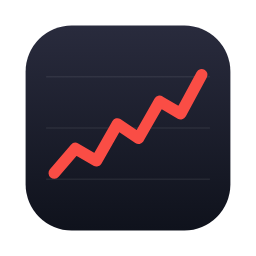
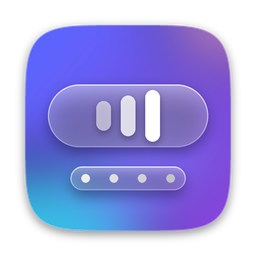

### 你好，我是了迹奇有没 👋

服务端工程师，也给 Mac 做些顺手的小工具。 
最近的四个都住在菜单栏里：原生 Swift，玻璃质感，开源免费。

[博客](https://whrss.com) · [RSS](https://whrss.com/feed) · [邮箱](mailto:whrss9527@gmail.com)

  
  
  
  

<table>
<tr>
<td width="50%" valign="top">

**最近发布**

<!-- RELEASES:START -->
-  [Stox v0.44.0](https://github.com/whrss9527/stox/releases/tag/v0.44.0) · 2026-09-29
-  [Pop v0.4.0](https://github.com/whrss9527/pop/releases/tag/v0.4.0) · 2026-09-29
-  [Meno v0.1.1](https://github.com/whrss9527/meno/releases/tag/v0.1.1) · 2026-09-29
-  [Proxi v0.11.0](https://github.com/whrss9527/proxi/releases/tag/v0.11.0) · 2026-09-29
<!-- RELEASES:END -->

</td>
<td width="50%" valign="top">

**最新文章**

<!-- BLOG-POSTS:START -->
- [给博客做了一轮大改：多端、离线、服务端渲染和一堆小东西](https://whrss.com/posts/goblog-refactor)
- [一致性事务：从 2PC 到 Outbox pattern](https://whrss.com/posts/transaction-consistency-patterns-2pc-outbox)
- [鸿蒙 OS 的签名密钥机制，我终于整明白了！](https://whrss.com/posts/harmonyos-signing-key)
- [数据库分表实践：如何优雅地切换到分表架构](https://whrss.com/posts/mysql-sharding-migration)
- [“该省省，该花花”](https://whrss.com/posts/smart-spending)
<!-- BLOG-POSTS:END -->

</td>
</tr>
</table>

### 技术栈

<!-- Languages -->

<!-- Backend & middleware -->

<!-- Deploy & observability -->

<!-- Tools -->

### 我的运动

数据来自 Apple 健康，[GitHub Action 自动更新](https://whrss.com/posts/github-poster)

  

  
  
  

